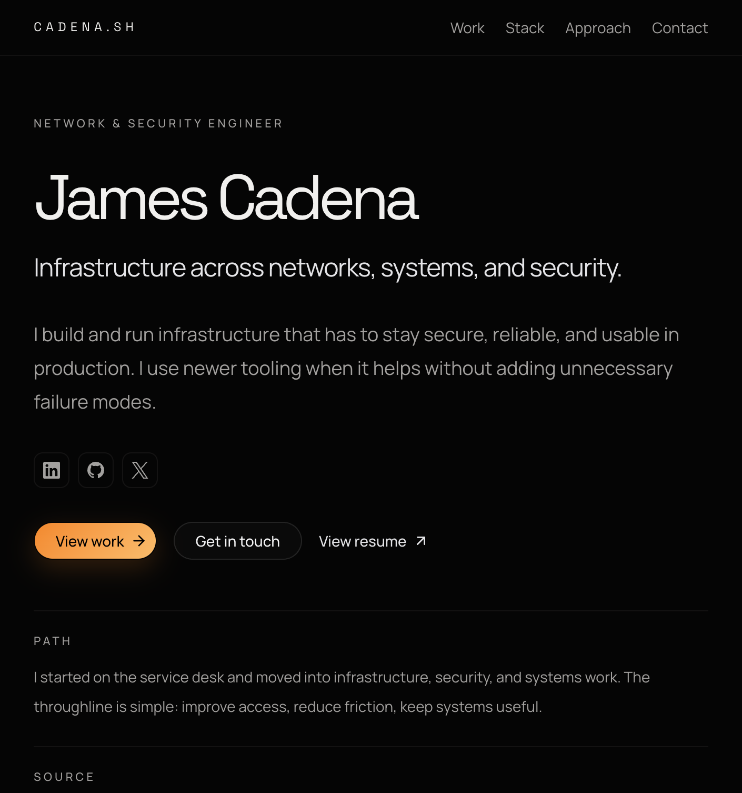

# cadena.sh

Source for my personal site, built for [james.cadena.sh](https://james.cadena.sh). I'm a network and security engineer, so the infra choices here (1Password-backed secrets, a pinned `op` CLI, Vercel BotID on the contact form, a nonce-based CSP, and a tiny edge POP status chip) reflect that background more than the frontend does. It's one page with a contact form.



## Stack

- Next.js App Router (Next 16, React 19)
- Tailwind CSS v4, shadcn/ui
- Resend for the contact form
- Vercel BotID for abuse protection
- Vercel Analytics + Speed Insights
- Nonce-based CSP via a Next.js proxy
- `/api/pop` footer chip for edge region, latency, and protocol visibility
- Vitest + Testing Library
- GitHub Actions CI + Dependabot
- 1Password Environments for build-time and runtime secrets
- Configured for Vercel deployment

## Run it locally

```bash
pnpm install
```

**With 1Password Environments (recommended).** The `cadena-sh` Environment UUID is referenced in [`.op/refs.env`](./.op/refs.env). With 1Password unlocked and the desktop `op` CLI available:

```bash
pnpm dev:op
```

This wraps `next dev` with `op run`, injecting secrets once at launch — no FIFO `.env.local` mount, so Next.js file watchers stay stable. Shell exports of `CADENA_SH_DEV_1PASSWORD_ENVIRONMENT_ID` override the file when set. `OP_ENVIRONMENT_ID` is reserved for Vercel build/deploy.

**Without 1Password.** Copy `.env.example` to `.env.local`, fill in the values, and run:

```bash
pnpm dev
```

The contact form expects these values, either from a 1Password Environment (via `dev:op`) or from direct local environment variables:

```bash
RESEND_API_KEY       # Resend API key
RESEND_FROM_EMAIL    # must live on a domain verified in Resend
RESEND_FROM_NAME     # display name for the From header
CONTACT_EMAIL_TO     # inbox that receives contact submissions
```

`RESEND_FROM_EMAIL` has to be on a domain you have verified in the Resend dashboard — otherwise Resend rejects the send at runtime and the contact form will surface a 500.

See [Secrets](#secrets) for the production source-of-truth model.

If you're running your own fork, you can also set `NEXT_PUBLIC_SITE_URL` (and optionally `NEXT_PUBLIC_APEX_URL`) to override the canonical origin used in metadata, `robots.txt`, `sitemap.xml`, and the contact route allowlist.

Open [http://localhost:3000](http://localhost:3000).

## Secrets

Secrets are managed in **1Password Environments**.

**Local dev.** Prefer `pnpm dev:op`, which reads `CADENA_SH_DEV_1PASSWORD_ENVIRONMENT_ID` from [`.op/refs.env`](./.op/refs.env) and wraps `next dev` with `op run`. Do not use a FIFO-mounted `.env.local` with Next.js — file watchers can restart in a loop. Forks should replace the UUID in `.op/refs.env` or fall back to plaintext `.env.local` from `.env.example`.

**Production (Vercel).** 1Password is the source of truth for contact-form secrets. Vercel stores only:

- `OP_SERVICE_ACCOUNT_TOKEN` — a scoped service account token with read-only access to this Environment
- `OP_ENVIRONMENT_ID` — the ID of the 1Password Environment to load

Build-time and runtime use different 1Password integrations:

1. `pnpm build:vercel` runs `scripts/install-op.sh` to fetch a pinned `op` CLI beta into `./bin/op`.
2. The installer verifies the downloaded archive against a pinned SHA-256 for the current platform.
3. The build command wraps `next build` with `op run --environment "$OP_ENVIRONMENT_ID"`, injecting the Environment values for the duration of the build subprocess.
4. The `POST /api/contact` runtime uses the beta `@1password/sdk` Environments API to read the same Environment with `OP_SERVICE_ACCOUNT_TOKEN` and `OP_ENVIRONMENT_ID`. It fails fast if the Environment read times out, and caches successfully resolved contact mail config for the warm function instance.

The beta CLI is required because `op run --environment` for 1Password Environments is still beta. The beta JavaScript SDK is required because programmatic reads from 1Password Environments are still beta. Versions and per-platform SHA-256 values are pinned where possible for reproducibility and integrity. If `OP_VERSION` changes before `scripts/install-op.sh` is updated, the build fails closed unless you also provide a verified `OP_SHA256`.

## Scripts

```bash
pnpm dev            # dev server (reads .env.local / process.env)
pnpm dev:op         # dev server with 1Password Environment injection
pnpm build          # next build (reads process.env as-is)
pnpm build:vercel   # installs op, then op run --environment -- next build
pnpm test           # vitest
pnpm lint           # eslint
pnpm format         # prettier write
```

## Contact flow

`POST /api/contact` (Node.js runtime). The order matters and is deliberately cheap-first:

1. Rejects requests from unexpected origins. The allowlist is `CANONICAL_ORIGIN`, `APEX_ORIGIN`, the current Vercel preview URL, and localhost outside production.
2. Verifies the request with [Vercel BotID](https://vercel.com/docs/botid) (the [`botid`](https://www.npmjs.com/package/botid) package). BotID is wired through `src/instrumentation-client.ts` on the client and checked server-side before the route parses any body.
3. Parses the JSON body and validates it with Zod. Honeypot hits return `200` silently so bots don't learn they were detected.
4. Loads the contact mail config from 1Password Environments at runtime when `OP_SERVICE_ACCOUNT_TOKEN` and `OP_ENVIRONMENT_ID` are present, with a fail-fast timeout so contact submissions do not hang on a stalled secret lookup. Local development can fall back to direct env vars when those 1Password runtime settings are absent.
5. Sends the message through [Resend](https://resend.com). `RESEND_FROM_EMAIL` must live on a domain verified in Resend. Provider errors are logged without message or stack in production.

## Automation

GitHub Actions runs CI on pushes and pull requests to `main`:

- `pnpm lint`
- `pnpm test`
- `pnpm build`

Dependabot checks weekly for npm and GitHub Actions updates.

## Security

See [SECURITY.md](./SECURITY.md) for the vulnerability-reporting policy and scope.

## Deployment

Configured for Vercel deployment with `james.cadena.sh` as the canonical host. Traffic to the apex `cadena.sh` is 301'd to the canonical subdomain at the Next.js routing layer (`next.config.ts`).

The Vercel build settings are source-controlled in `vercel.json`:

- Build Command: `pnpm build:vercel`
- Install Command: `pnpm install --frozen-lockfile`

The Vercel project stores only these environment variables:

- `OP_SERVICE_ACCOUNT_TOKEN`
- `OP_ENVIRONMENT_ID`

## License

[MIT](./LICENSE)
