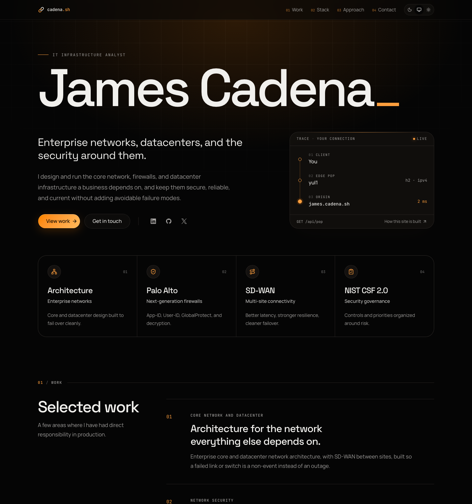

# cadena.sh

[](https://github.com/j-cadena-g/cadena-sh/actions/workflows/ci.yaml)

Source for [james.cadena.sh](https://james.cadena.sh), my personal site. It's one page with a contact form and a live trace of your connection through Vercel's edge.



## Stack

- Next.js 16 (App Router), React 19, Tailwind CSS v4, shadcn/ui
- Resend for the contact form, Vercel BotID for bot protection
- Nonce-based CSP from `src/proxy.ts`
- 1Password Environments for secrets at build time and runtime
- Vitest and Testing Library, CI on GitHub Actions, Dependabot

## Run it locally

```bash
pnpm install
cp .env.example .env.local   # fill in the values below
pnpm dev
```

The contact form needs:

```bash
RESEND_API_KEY       # Resend API key
RESEND_FROM_EMAIL    # must be on a domain verified in Resend, or sends fail with a 500
RESEND_FROM_NAME     # display name for the From header
CONTACT_EMAIL_TO     # inbox that receives submissions
```

To load them from a 1Password Environment instead, copy [`.op/refs.env.example`](./.op/refs.env.example) to `.op/refs.env`, set `CADENA_SH_DEV_1PASSWORD_ENVIRONMENT_ID` to the Environment's UUID (Developer → Environments → Manage environment), and run `pnpm dev:op`. It wraps `next dev` in `op run`; don't mount `.env.local` as a FIFO instead, since that sends the Next.js file watcher into a restart loop. `OP_ENVIRONMENT_ID` is reserved for Vercel.

Forks can set `NEXT_PUBLIC_SITE_URL` (and optionally `NEXT_PUBLIC_APEX_URL`) to change the canonical origin used in metadata, `robots.txt`, `sitemap.xml`, and the contact route's origin allowlist.

## Scripts

```bash
pnpm dev            # dev server, env from .env.local
pnpm dev:op         # dev server, env from 1Password
pnpm build          # next build
pnpm build:vercel   # install the pinned op CLI, then build under op run
pnpm test           # vitest
pnpm lint           # eslint + markdownlint
pnpm format         # prettier
```

## Contact form

`POST /api/contact` runs on the Node.js runtime and does the cheap checks first:

1. Rejects unexpected origins. The canonical and apex origins and the current Vercel preview URL are allowed, plus localhost outside production.
2. Verifies the request with [Vercel BotID](https://vercel.com/docs/botid) before reading the body. The client side is set up in `src/instrumentation-client.ts`.
3. Validates the JSON body with Zod. Honeypot hits get a silent `200`.
4. Loads the mail config from 1Password when `OP_SERVICE_ACCOUNT_TOKEN` and `OP_ENVIRONMENT_ID` are set, with a fail-fast timeout, and from plain env vars otherwise.
5. Sends through [Resend](https://resend.com). In production, failures are logged without the error message or stack.

## Deployment

Vercel runs `pnpm build:vercel` (see `vercel.json`) and stores only two variables: `OP_SERVICE_ACCOUNT_TOKEN`, a service account token with read-only access to your Environment, and `OP_ENVIRONMENT_ID`.

- **Build:** `scripts/install-op.sh` downloads a pinned `op` CLI beta and checks it against a pinned per-platform SHA-256. If `OP_VERSION` changes without a verified `OP_SHA256`, the build fails closed. `next build` then runs under `op run --environment`.
- **Runtime:** the contact route reads the same Environment with the `@1password/sdk` beta and caches it for the warm instance.

Both are betas because 1Password Environments are still in beta in the CLI and the SDK.

Requests to `cadena.sh` get a 301 to `james.cadena.sh` (`next.config.ts`). CI runs lint, tests, and a build on pushes and pull requests to `main`.

## Security

Report vulnerabilities as described in [SECURITY.md](./SECURITY.md).

## License

[MIT](./LICENSE)
